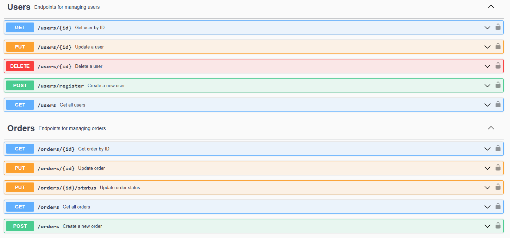
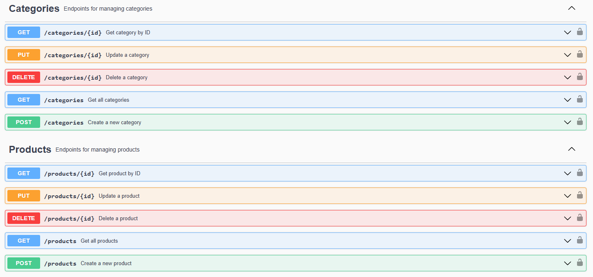
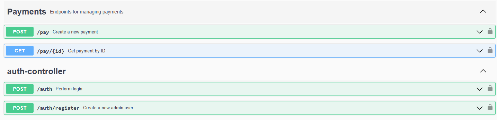

# Projeto Spring Boot com Segurança JWT

Este é um projeto Spring Boot que implementa uma API RESTful de gerenciamento de pedidos com autenticação e autorização baseada em JWT (JSON Web Token). O projeto utiliza Spring Security para gerenciar a segurança, Spring Data JPA para persistência de dados e Swagger para documentação da API.

## Tecnologias Utilizadas

- **Spring Boot**: Framework para desenvolvimento de aplicações Java.
- **Spring Security**: Gerenciamento de autenticação e autorização.
- **JWT (JSON Web Token)**: Autenticação stateless via tokens.
- **Spring Data JPA**: Persistência de dados com JPA e Hibernate.
- **Spring Validation**: Validação de dados de entrada.
- **Spring Boot Test**: Testes unitários e de integração.
- **Swagger (OpenAPI)**: Documentação interativa da API.
- **Banco de Dados**: Configurado para uso com PostGres com JPA.

## Funcionalidades Principais

- **Login com geração de token JWT**
- **Proteção de endpoints com base em roles (ADMIN e USER)**
- **Gestão de Usuários**
- **Gestão de Produtos**
- **Gestão de Categorias**
- **Gestão de Pedidos**
- **Gestão de Pagamentos**
- **Documentação interativa com Swagger (OpenAPI)**

## Arquitetura do Projeto

O projeto segue uma arquitetura em camadas, com separação clara de responsabilidades. A estrutura é organizada da seguinte forma:

### Camadas Principais

1. **Controller (API Layer)**:
- Responsável por receber as requisições HTTP e enviar as respostas.
- Expõe os endpoints da API.
- Valida os dados de entrada (DTOs) e repassa as requisições para a camada de serviço.

2. **Service (Business Layer)**:
- Contém a lógica de negócio do sistema.
- Realiza operações como validações, regras de negócio e interações com o banco de dados.
- Utiliza os repositórios para acessar os dados.

3. **Repository (Data Access Layer)**:
- Responsável pela comunicação com o banco de dados.
- Utiliza Spring Data JPA para realizar operações CRUD nas entidades.

4. **Entity (Domain Layer)**:
- Representa as tabelas do banco de dados.
- Define os relacionamentos entre as entidades e os atributos de cada uma.

5. **DTO (Data Transfer Object)**:
- Objetos usados para transferir dados entre as camadas.
- Evita expor diretamente as entidades do banco de dados.

6. **Security**:
- Configurações de autenticação e autorização.
- Utiliza JWT para gerenciar tokens de acesso.

7. **Exceptions**:
- Tratamento personalizado de exceções.
- Lança exceções específicas para erros de negócio e técnicos.

## Relacionamentos entre Entidades

O projeto possui as seguintes entidades principais e seus relacionamentos:

### 1. **User (Usuário)**
- **Relacionamentos**:
  - Um usuário pode ter **múltiplos pedidos** (`Order`).
  - Um usuário pode ter **múltiplos pagamentos** (`Payment`).

### 2. **Role (Papel)**
- **Relacionamentos**:
  - Um papel pode estar associado a **múltiplos usuários**.

### 3. **Product (Produto)**
- **Relacionamentos**:
  - Um produto pode estar em **múltiplos pedidos** (`OrderItem`).

### 4. **Category (Categoria)**
- **Relacionamentos**:
  - Uma categoria pode estar associada a **múltiplos produtos**.

### 5. **Order (Pedido)**
- **Relacionamentos**:
  - Um pedido pertence a **um usuário** (`User`).
  - Um pedido pode ter **múltiplos itens** (`OrderItem`).

### 6. **OrderItem (Item do Pedido)**
- **Relacionamentos**:
  - Um item do pedido está associado a **um pedido** (`Order`).
  - Um item do pedido está associado a **um produto** (`Product`).

### 7. **Payment (Pagamento)**
- **Relacionamentos**:
  - Um pagamento está associado a **um pedido** (`Order`).
  - Um pagamento pertence a **um usuário** (`User`).

## Endpoints
  
## Como Executar o Projeto

1. **Pré-requisitos**:
  - Java 17 ou superior.
  - Maven instalado.
  - Banco de dados configurado (ou H2 em memória).

2. **Clone o Repositório**:
   ```bash
   git clone https://github.com/lucaslarry/SpringBootWebService
   cd SpringBootWebService
   ```

3. **Configuração do Banco de Dados**:
  - Edite o arquivo `application.properties` para configurar o banco de dados desejado.
  - Exemplo para **PostgreSQL**:
    ```properties
    spring.datasource.url=jdbc:postgresql://localhost:5432/nome_do_banco
    spring.datasource.username=seu_usuario
    spring.datasource.password=sua_senha
    spring.jpa.database-platform=org.hibernate.dialect.PostgreSQLDialect
    spring.jpa.hibernate.ddl-auto=update
    ```
  - Exemplo para **H2 (em memória)**:
    ```properties
    spring.datasource.url=jdbc:h2:mem:testdb
    spring.datasource.driverClassName=org.h2.Driver
    spring.datasource.username=sa
    spring.datasource.password=password
    spring.jpa.database-platform=org.hibernate.dialect.H2Dialect
    spring.h2.console.enabled=true
    ```

4. **Execute o Projeto**:
  - No terminal, execute o seguinte comando:
    ```bash
    mvn spring-boot:run
    ```

5. **Acesse a Documentação da API**:
  - Abra o navegador e acesse:
    ```
    http://localhost:8080/swagger-ui.html
    ```
  - A documentação interativa da API estará disponível para explorar os endpoints.

6. **Banco de Dados H2 (Opcional)**:
  - Se estiver usando o H2, você pode acessar o console do banco de dados em:
    ```
    http://localhost:8080/h2-console
    ```
  - Use as credenciais configuradas no `application.properties`.